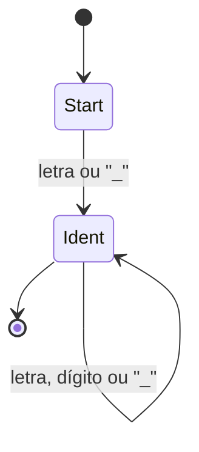
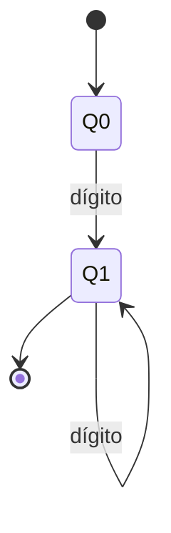
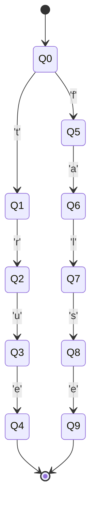
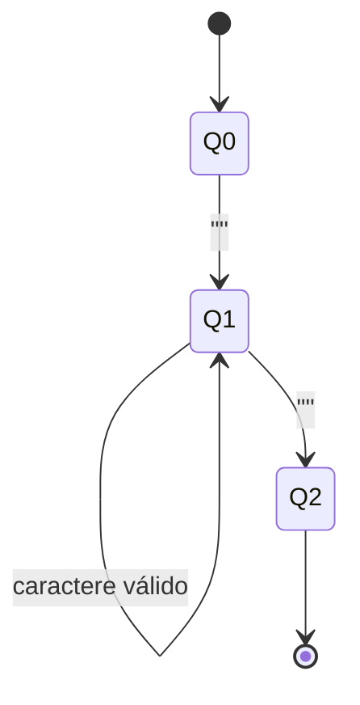
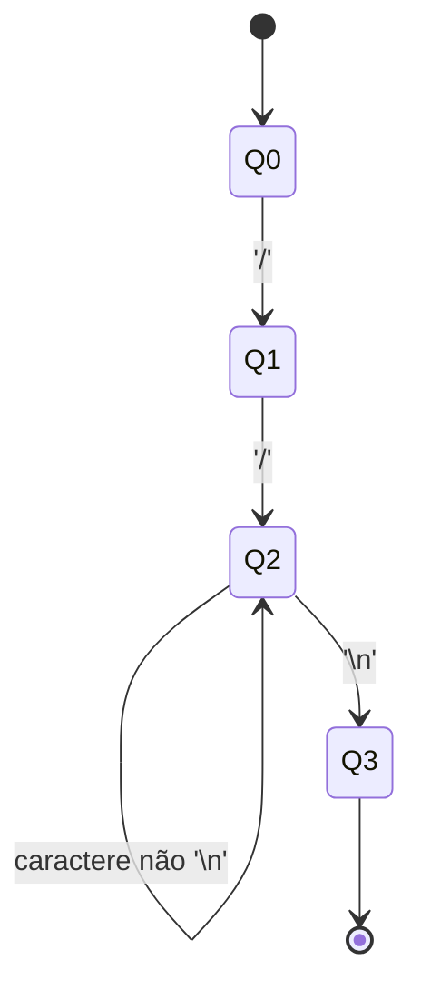
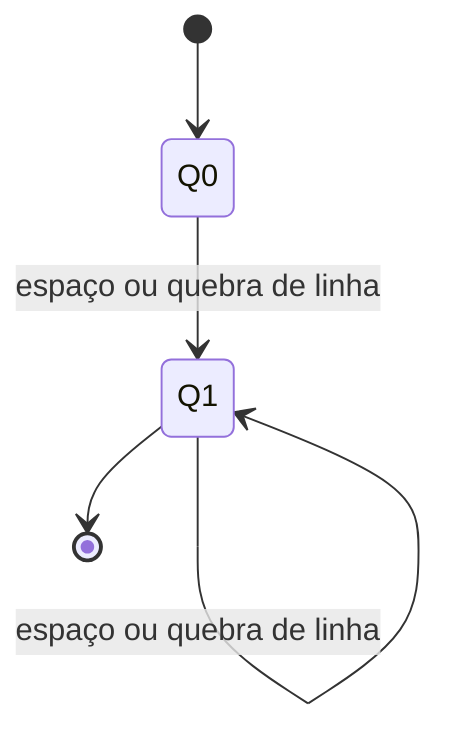

# Entrega Semana 5 - Projeto Integrador

## Diagramas dos AFDs

### Identificadores
Regex: `[a-zA-Z_][a-zA-Z0-9_]*`



### Números inteiros
Regex: `[0-9]+`



### Booleanos
Regex: `true|false`



### Strings
Regex: `"([^"]|.)*"`



### Palavras-chave
Regex: `int|bool|if|else|loop|for|to|out|fim`

Exemplo para `int`:


(O mesmo se aplica para as demais palavras-chave.)

### Operadores
Regex: `==|!=|<=|>=|&&||...`

Exemplo para `==`:


### Delimitadores
Regex: `(|)|,|[|]`


(Repete-se para cada delimitador.)

### Comentários de linha
Regex: `//[^n]*`



### Espaços em branco
Regex: `[ 	
]+`



---

## Implementação em Java

```java
public class Automato {
    private int estadoAtual;
    private int[][] transicoes;
    private boolean[] finais;

    public Automato(int[][] transicoes, boolean[] finais) {
        this.estadoAtual = 0;
        this.transicoes = transicoes;
        this.finais = finais;
    }

    public boolean processa(String entrada) {
        estadoAtual = 0;
        for (char c : entrada.toCharArray()) {
            int simbolo = mapearSimbolo(c);
            if (simbolo == -1) return false;
            estadoAtual = transicoes[estadoAtual][simbolo];
            if (estadoAtual == -1) return false;
        }
        return finais[estadoAtual];
    }

    private int mapearSimbolo(char c) {
        if (Character.isLetter(c)) return 0;
        if (Character.isDigit(c)) return 1;
        if (c == '_') return 2;
        return -1;
    }
}
```

---


## Testes Unitários

```java
@Test
public void testIdentificador() {
    Automato ident = Automatos.getIdentificador();
    assertTrue(ident.processa("x"));
    assertTrue(ident.processa("variavel1"));
    assertFalse(ident.processa("1abc"));
}
```
Resultados Esperados

Entrada: "x" => Aceito

Entrada: "variavel1" => Aceito 

Entrada: "1abc" => Rejeitado 
---
